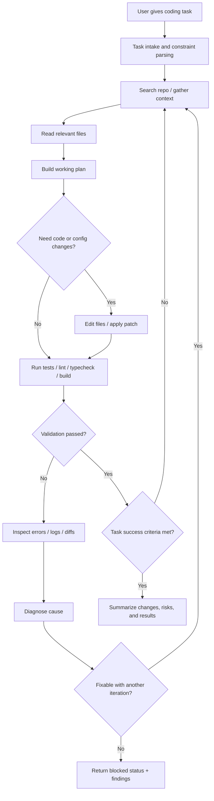
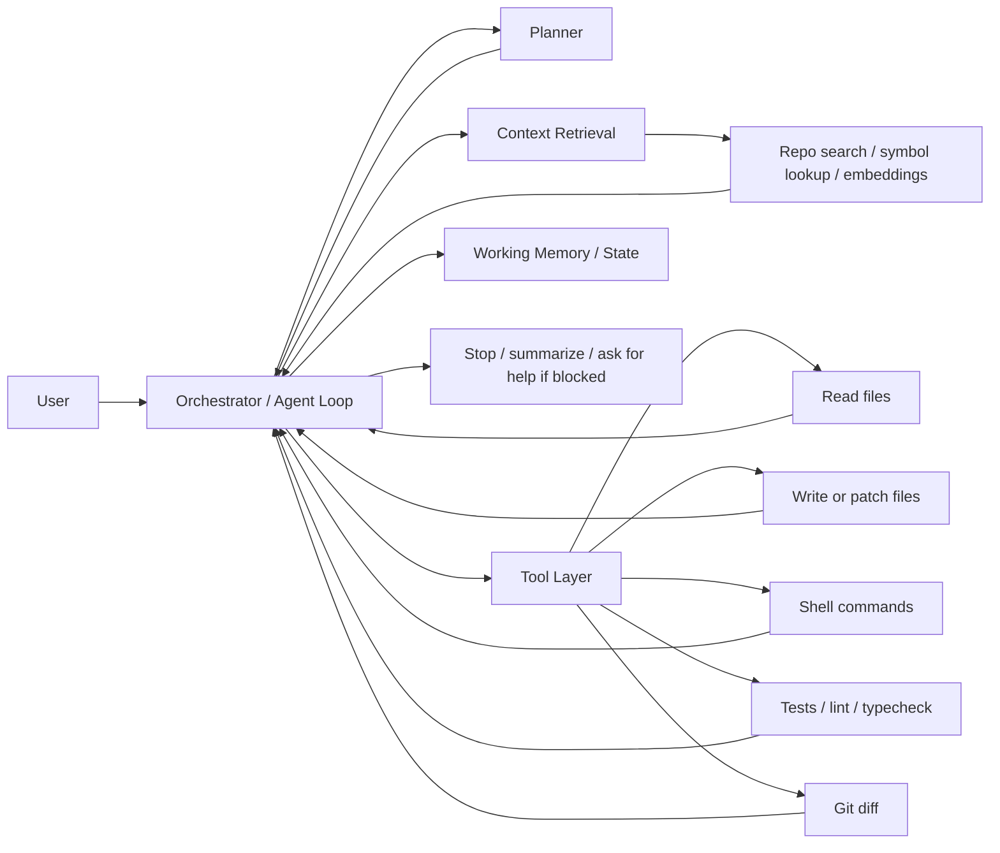

# Overview
This doc is to decompose the project into more manageable pieces.

## Components of a Coding Agent
Typical coding agent loop:

```mermaid
flowchart TD
    A[User gives coding task] --> B[Task intake and constraint parsing]
    B --> C[Search repo / gather context]
    C --> D[Read relevant files]
    D --> E[Build working plan]

    E --> F{Need code or config changes?}
    F -->|Yes| G[Edit files / apply patch]
    F -->|No| H[Run checks directly]

    G --> H[Run tests / lint / typecheck / build]
    H --> I{Validation passed?}

    I -->|No| J[Inspect errors / logs / diffs]
    J --> K[Diagnose cause]
    K --> L{Fixable with another iteration?}

    L -->|Yes| C
    L -->|No| M[Return blocked status + findings]

    I -->|Yes| N{Task success criteria met?}
    N -->|No| C
    N -->|Yes| O[Summarize changes, risks, and results]
```

More architecutre based version:

```mermaid
flowchart LR
    U[User] --> O[Orchestrator / Agent Loop]
    O --> P[Planner]
    O --> R[Context Retrieval]
    O --> T[Tool Layer]
    O --> M[Working Memory / State]

    R --> FS[Repo search / symbol lookup / embeddings]
    T --> RF[Read files]
    T --> WF[Write or patch files]
    T --> SH[Shell commands]
    T --> TS[Tests / lint / typecheck]
    T --> GD[Git diff]

    P --> O
    FS --> O
    RF --> O
    WF --> O
    SH --> O
    TS --> O
    GD --> O

    O --> S[Stop / summarize / ask for help if blocked]
```