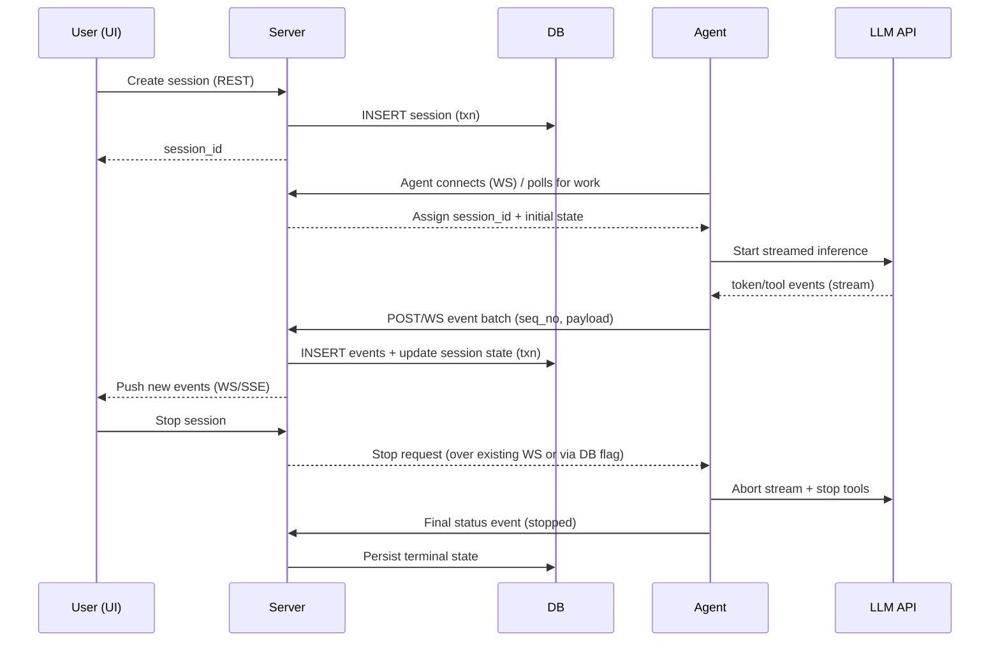

# Technical Challenges and Considerations for a Sync-Based Headless Coding Agent System

## Executive summary

The attached materials describe a three-part system: a **server process** (with a database and user-facing APIs), a **headless coding agent daemon** that runs “anywhere” and **connects outward to the server**, and a **reactive UI** that stays in near‑real‑time sync with sessions stored in the server-managed database. fileciteturn0file0L10-L33 The core hard problem is **reliable, secure, backpressure-aware event streaming** across *agent → server → UI* while also supporting **session lifecycle control** (create/stop), durable persistence, and reproducible deployment via `docker compose up`. fileciteturn0file0L31-L65

The highest-risk challenges cluster around:  
1) **Event ordering + replay + reconnection semantics** (especially if you stream tokens/tool events at high frequency), citeturn8search0turn7view0  
2) **Cancellation propagation** (stop session must reliably interrupt model streaming + tool execution), fileciteturn0file0L31-L33  
3) **Security boundaries** (agent executes code; WebSockets/SSE are easy to mis-secure; LLM tool use is exposed to injection), citeturn2search1turn0search9turn5search0  
4) **Docker-compose-first operability** (dependency startup order, env management, deterministic builds), citeturn1search2turn1search1turn17search0  
5) **Testing realism** (end-to-end tests must exercise a distributed, streaming system while keeping inference costs optional). citeturn16search1turn15search1turn6search0

Because the attachment is an assessment prompt, it does **not** include specific architecture diagrams, data models, API schemas, authentication requirements, tool definitions, or codebase constraints beyond the listed rules (TypeScript-only, no Next.js, must ship docker-compose, etc.). fileciteturn0file0L34-L65 Those omissions materially affect detailed risk in security, scalability, and compliance; this report flags exactly what to supply.

## Project understanding and missing information

### What the attachment specifies

The prompt (from entity["company","HumanLayer","ai workflow tools"]) requires: a server with a relational database and APIs; a daemonized coding agent with an “agent loop” (inference calls, state); and a reactive UI that syncs live session progress from the database. fileciteturn0file0L10-L33 The agent must **connect outward** (no server-initiated inbound connections), and it must stream events (tool calls, “thinking tokens,” assistant messages) to the server “in live time,” where they are **persisted**. fileciteturn0file0L22-L27

The deliverable is constrained to: TypeScript everywhere, no existing coding-agent SDKs, no paid dependencies besides an LLM key, **must not use Next.js**, and must provide a `docker-compose` setup with separate containers for server/UI, database, and a no-inbound-ports agent container. fileciteturn0file0L34-L65

### Material details missing from the attachment (you should supply)

To make risk assessment precise (especially security/compliance), the following are missing:

- **Concrete tool surface**: What tools can the agent invoke? (shell execution, filesystem read/write, git operations, HTTP fetch, package installs, etc.). This is the single biggest driver of security boundary design. citeturn5search0turn2search1  
- **Identity & access model**: Is there authentication? Are there multiple users? Do agents have per-agent credentials? Are sessions scoped to users/tenants? citeturn0search9turn2search1  
- **API contract**: Endpoints, event schemas, error semantics, pagination/replay semantics. (If undefined, you will rework it repeatedly under UI/agent pressure.) citeturn1search6turn7view0  
- **Persistence model**: Expected tables/entities; retention policy; whether “thinking tokens” must be stored verbatim; how event ordering is defined. fileciteturn0file0L25-L27  
- **Operational targets**: expected concurrency (# sessions, # agents), latency targets, and acceptable eventual consistency.  
- **LLM provider choice(s)**: entity["company","OpenAI","ai platform company"] vs entity["company","Anthropic","ai safety company"] vs entity["company","Google","technology company"] vs local inference have different streaming formats and cancellation behavior, plus different retention defaults. citeturn6search0turn6search6turn10search2turn11search1  
- **Compliance scope**: whether user data or proprietary code is processed, and where users are located (GDPR/CCPA relevance). citeturn9search0turn10search2turn11search1

## Reference architecture and data flow model

### Recommended baseline component model

Because the agent must initiate connectivity and stream continuously, a practical baseline is:

- UI ↔ Server: **WebSocket** (bidirectional) or **SSE (server → browser)** plus REST for commands. WebSockets support full duplex semantics. citeturn12search1turn7view0  
- Agent ↔ Server: **Agent-initiated persistent WebSocket** or **long polling**. WebSockets map naturally to “server assigns work over an existing connection,” which respects the “server may not initiate connections” requirement. fileciteturn0file0L22-L24 citeturn12search1turn2search1  
- Server ↔ DB: RDBMS as the system of record; consider Postgres `LISTEN/NOTIFY` to wake up other server instances (optional), because it’s built-in IPC. citeturn14search1turn14search0

### Data flow diagram

```mermaid
flowchart LR
  UI[Web UI] <--> |REST for commands| API[Server API]
  UI <-->|WS or SSE for live sync| RT[Realtime Gateway]

  subgraph Server
    API
    RT
    SESS[Session Orchestrator]
    EVT[Event Store Writer]
  end

  DB[(Postgres / SQL DB)]
  SESS --> DB
  EVT --> DB
  RT --> DB

  AGENT[Headless Agent Daemon]
  AGENT -->|outbound connect (WS/HTTP)| RT
  AGENT -->|streams events| EVT

  LLM[LLM Provider API]
  AGENT <-->|SSE/streaming responses| LLM
```

This reflects the required “agent connects out” pattern and the required persistence of streamed events. fileciteturn0file0L22-L27 citeturn12search1turn6search0turn6search6

### Session lifecycle sequence and replay



SSE defines reconnection support via `Last-Event-ID`, which you can reuse as a conceptual model even if you implement WebSocket replay (store monotonically increasing event IDs and let consumers resume). citeturn7view0

## Dimension-by-dimension considerations, likely challenges, mitigations, and risk/effort

The sections below follow the requested pattern for each dimension: (1) considerations, (2) likely challenges & root causes, (3) mitigations & tooling, (4) relative risk and mitigation effort.

### System architecture

**Considerations.** The architecture is effectively a small distributed system: UI client(s), server, agent(s), DB, and an external inference API. fileciteturn0file0L10-L27 The requirement that the daemon can run in a private network forces a “control plane / worker” architecture with **agent-initiated connectivity**. fileciteturn0file0L22-L24

**Likely challenges & root causes.** A common failure mode is accidentally blending responsibilities: letting UI state become the source of truth, or letting the agent be “stateful” in ways the server cannot reconstruct. That becomes painful when clients reconnect or when multiple agents exist. Durable state belongs behind the server boundary (DB-backed), but that increases pressure to design a coherent event/state model early. fileciteturn0file0L25-L33

**Mitigations & tooling.** Adopt an explicit **event log + derived state** structure: persist every agent event with `(session_id, seq_no, type, payload, ts)` and derive a session summary/projection in a separate table or materialized view. If you expect multiple server processes, Postgres `LISTEN/NOTIFY` can provide lightweight cross-process wakeups without adding a paid broker. citeturn14search0turn14search1

**Risk / effort.** Risk: **High** (core correctness). Effort: **Medium–High** (requires up-front data modeling and protocols).

### Data flows

**Considerations.** You have two streaming paths: agent → server (high-frequency events) and server → UI (reactive sync). The HTML SSE spec formalizes reconnection and `Last-Event-ID`, and it explicitly recommends keepalive comment lines to survive proxies. citeturn7view0 Node stream backpressure is relevant for implementing “token streaming” without memory blowups. citeturn8search0turn8search3

**Likely challenges & root causes.**  
- **Event ordering gaps**: reconnects can create duplicates, missed ranges, or partial batches if you don’t define sequence semantics. citeturn7view0turn14search1  
- **Backpressure and memory bloat**: if UI is slow or disconnected, buffering token deltas can accumulate; Node explicitly warns about continuing to write to non-draining streams. citeturn8search3  
- **Over-chatty persistence**: writing every token to the DB can generate heavy write amplification; if you later paginate/replay, it gets expensive.

**Mitigations & tooling.**  
- Define a **monotonic `seq_no` per session** generated by the agent (or assigned by the server on ingest) and enforce uniqueness with a DB constraint (idempotency). This mirrors the “resume from last ID” idea in SSE. citeturn7view0  
- Implement **coalescing**: store token deltas in short in-memory buffers and flush every N ms or when size thresholds are met (with a final flush at completion). Pair with durable checkpoints (e.g., “assistant_message_completed”) so replay doesn’t require token-by-token reconstruction.  
- Use **batched inserts** and carefully chosen indexes (composite indexes on `(session_id, seq_no)`), and keep transactions short if you rely on `NOTIFY` because Postgres delivers notifications on commit and long transactions interfere with real-time signaling. citeturn14search0turn14search1

**Risk / effort.** Risk: **High**. Effort: **High** (it touches protocol, persistence, and UI).

### APIs and integration

**Considerations.** The project needs at least: session create/stop APIs, agent registration/heartbeat, session assignment, and event ingestion/streaming APIs. fileciteturn0file0L10-L33 A formal contract (OpenAPI) reduces churn between UI/agent and server. citeturn1search6

**Likely challenges & root causes.**  
- **Mismatch between command APIs and streaming APIs**: mixing REST commands with streaming updates produces race conditions (stop while events still in-flight).  
- **Retry semantics**: if agent retries POSTing events, you need idempotency rules; HTTP semantics define idempotent methods and why retry safety matters if connections close mid-flight. citeturn2search2turn2search3  
- **Provider streaming differences**: OpenAI streams “semantic events” over SSE; Anthropic supports SSE and even fine-grained tool parameter streaming that can be partial/invalid JSON. citeturn6search0turn6search6turn6search1

**Mitigations & tooling.**  
- Publish an **OpenAPI 3.1 spec** for REST endpoints and a separate typed schema for event frames (e.g., Zod/TypeBox shared between server and agent/UI). citeturn1search6turn6search5  
- Treat event ingestion as **idempotent** using `(session_id, seq_no)` as a natural key; accept duplicates safely. Tie UI replay to seq ranges. citeturn2search2turn7view0  
- Normalize LLM provider streams into a provider-agnostic internal event model (e.g., `model_output.delta`, `tool_call.started`, `tool_call.delta`, `tool_call.completed`, `final_message`). This is aligned with OpenAI’s typed streaming events and Anthropic’s explicit SSE event types. citeturn6search0turn6search6

**Risk / effort.** Risk: **Medium–High**. Effort: **Medium**.

### Security and privacy

**Considerations.** You are building an agent that runs code/tools and streams internal state, plus a real-time web interface. WebSockets and long-lived connections change the threat model (CSWSH, connection exhaustion, message-level auth). citeturn2search1turn12search1 If the agent uses tool calling, prompt injection and excessive agency are recognized risks for LLM applications. citeturn5search0turn19search40 If you send code/prompt content to providers, default retention and training policies matter (and vary by provider and plan). citeturn10search2turn11search1

**Likely challenges & root causes.**  
- **Auth gaps on realtime channels**: OWASP notes WebSockets have no built-in auth and need explicit origin validation and message-level authorization. citeturn2search1  
- **Resource consumption attacks**: OWASP API Top 10 highlights “Unrestricted Resource Consumption,” which is especially relevant to token streams and persistent sockets. citeturn0search9  
- **Prompt injection / unsafe tool use**: OWASP’s LLM Top 10 calls out prompt injection and excessive agency; if the agent can run shell commands or edit files, the impact can be immediate. citeturn5search0turn19search40  
- **Sensitive data persistence**: storing “thinking tokens” and tool call arguments may capture secrets (API keys, proprietary code) unless redacted. fileciteturn0file0L25-L27  
- **Provider retention expectations**: OpenAI’s API docs describe 30-day abuse monitoring logs by default; Anthropic’s privacy center describes 30-day deletion for API inputs/outputs under standard terms. citeturn10search2turn11search1

**Mitigations & tooling.**  
- Implement **strong authentication** for UI and agent independently (e.g., user JWT + agent API key). Apply message-level authorization on WebSockets per OWASP guidance (don’t assume “connected == authorized”). citeturn2search1turn0search9  
- Enforce **origin allowlists**, payload size caps, per-connection rate limits, and heartbeat timeouts; OWASP explicitly recommends these for WebSocket security and DoS resistance. citeturn2search1  
- For LLM tool access: apply OWASP GenAI guidance—minimize tool permissions, validate all tool inputs/outputs, and add human-in-the-loop gates for destructive actions (“excessive agency” mitigation). citeturn5search0turn19search40  
- Add **redaction pipelines** (regex + allowlist-based secret detection) before persisting or logging, and configure retention windows. Align expectations with provider policies (OpenAI/Anthropic) and document them. citeturn10search2turn11search1

**Risk / effort.** Risk: **High**. Effort: **High** (security is cross-cutting and easiest to underbuild).

### Scalability and performance

**Considerations.** Long-lived connections and token-level streams are performance-sensitive; the system can be “fine” at 1–5 sessions and fall over at 50–200 if you persist every delta synchronously. Node stream backpressure is directly relevant when writing to sockets/HTTP responses. citeturn8search3turn12search1 Postgres `NOTIFY` has payload and queue behaviors that matter if you use it as a pub/sub backbone. citeturn14search0turn14search1

**Likely challenges & root causes.**  
- **DB write amplification** from high-frequency events.  
- **Connection fanout**: each active session might mean multiple open sockets (agent ↔ server and UI ↔ server), increasing memory use and file descriptor pressure.  
- **Hot-path JSON serialization** for token deltas and tool streaming (and potentially partial JSON from providers). citeturn6search1turn6search0  
- **Notification overload**: `NOTIFY` warns about queue growth and transaction constraints; it’s “lightweight,” but not a full broker. citeturn14search0turn14search1

**Mitigations & tooling.**  
- Use a **two-tier event model**: store “high-fidelity” token deltas in a rolling buffer but persist only meaningful milestones (or persist deltas in batches). Apply server-side throttling for UI updates. citeturn8search3turn7view0  
- Prefer **append-only inserts** with minimal indexes on hot tables; add read-optimized indexes only after measurement.  
- If you use Postgres notifications: keep payloads small (Postgres documents an <8000 byte default payload limit and recommends storing structured data in tables, notifying keys). citeturn14search0turn14search3

**Risk / effort.** Risk: **Medium–High**. Effort: **Medium** (most mitigations are straightforward but require discipline).

### Reliability and availability

**Considerations.** Streaming systems must handle retries, duplicates, and partial failures. HTTP semantics define why idempotency matters when connections drop and clients retry. citeturn2search2turn2search3 Postgres `NOTIFY` is delivered at commit and can be delayed by long transactions, affecting “live” behavior. citeturn14search0turn14search1

**Likely challenges & root causes.**  
- **At-least-once delivery** on event ingestion creates duplicates unless deduped.  
- **Lost stop signals** if cancellation is only “best effort” over a flaky channel.  
- **Split-brain session execution** if multiple agents can claim the same session without a lease/lock mechanism.

**Mitigations & tooling.**  
- Use **leases**: session has `claimed_by_agent_id`, `lease_expires_at`; agent heartbeats renew; server reassigns if lease expires.  
- Enforce **idempotent event writes** via unique constraints and retry-safe APIs (align with HTTP idempotency principles). citeturn2search2turn2search3  
- Model stop as **durable intent** in DB (e.g., `stop_requested_at`) plus best-effort realtime delivery; agent always checks stop flag between steps/tool calls.  

**Risk / effort.** Risk: **High**. Effort: **Medium–High**.

### Deployment and CI/CD

**Considerations.** The system must be runnable by a reviewer with `.env` and `docker compose up`, and the agent container may not expose ports. fileciteturn0file0L55-L65 Compose supports dependency ordering with healthchecks and `depends_on` conditions. citeturn1search2turn1search0 Docker BuildKit improves build performance and caching, which matters for reviewer experience and CI. citeturn17search0turn17search1

**Likely challenges & root causes.**  
- **Race conditions at startup**: server starts before DB is ready; agent starts before server endpoints exist. citeturn1search2turn1search0  
- **Env propagation mismatch**: `.env` vs container environment vs compose interpolation. citeturn1search1turn1search4  
- **Non-deterministic builds** due to package manager variance across dev machines.

**Mitigations & tooling.**  
- Add DB healthchecks and gate server startup on `service_healthy`. citeturn1search2turn1search0  
- Use Compose interpolation patterns and validate env with `docker compose config --environment` (Docker docs). citeturn1search1  
- Use BuildKit and cache in CI (GitHub Actions + cache backends). citeturn17search0turn17search1turn17search2  
- For DX determinism, pin package manager with Node Corepack (even if experimental, it is designed to standardize package manager versions). citeturn18search1turn18search3

**Risk / effort.** Risk: **Medium**. Effort: **Medium**.

### Testing and QA

**Considerations.** Your correctness risk is concentrated in streaming + concurrency + cancellation, which are notoriously hard to test with unit tests alone. Playwright supports end-to-end testing and explicitly emphasizes auto-waiting to reduce flakiness. citeturn16search1turn16search0 MSW can mock network requests at the network layer in browser/Node, which helps test without paid inference. citeturn15search1turn15search0

**Likely challenges & root causes.**  
- **Non-deterministic agent outputs** (LLMs) make golden tests hard. citeturn6search0turn6search6  
- **Integration test brittleness** due to timing (streaming, reconnects).  
- **Mock drift**: mocks become unrealistic compared to provider streams (especially with tool streaming). citeturn6search1turn6search0

**Mitigations & tooling.**  
- Separate tests into: deterministic protocol tests (fake agent emitting scripted events), contract tests (OpenAPI + schema validation), and a small number of “real LLM” smoke tests behind an env flag. citeturn1search6turn6search0  
- Use Playwright for UI-level flows (create session, see live updates, stop session) and MSW/fake servers to simulate streaming endpoints. citeturn16search1turn15search1turn7view0  
- Use a Vite-native unit runner like Vitest if you adopt Vite for the frontend; it is designed to reuse Vite’s pipeline and supports TypeScript out of the box. citeturn15search3

**Risk / effort.** Risk: **Medium–High**. Effort: **High** (integration testing effort is front-loaded but pays off).

### Observability and monitoring

**Considerations.** Debugging a streaming distributed system without traces is slow. OpenTelemetry defines vendor-neutral approaches to collecting telemetry and describes cross-cutting concerns (signals, context propagation). citeturn4search0turn4search7 W3C Trace Context standardizes propagation headers to correlate requests across services. citeturn4search5turn4search6 Prometheus defines a text exposition format and specific ingestion requirements. citeturn2search0turn13search1

**Likely challenges & root causes.**  
- **No correlation ID** linking UI actions → server request → agent processing → provider calls.  
- **Blind spots inside WebSocket message streams**: OWASP notes typical HTTP logs capture only the upgrade request, not subsequent message traffic. citeturn2search1  
- **High-cardinality logging** (token events) can become expensive and noisy.

**Mitigations & tooling.**  
- Instrument with OpenTelemetry SDKs (server + agent). Propagate W3C trace context in HTTP headers and in WS/SSE message envelopes. citeturn4search0turn4search5turn3search0  
- Expose Prometheus metrics for: active sessions, event ingest rate, WS connection count, DB latency, provider latency. citeturn2search0turn13search1  
- Log structured “milestones” not raw token streams; keep raw token logs behind debug flags (and never log secrets). citeturn2search1turn10search2

**Risk / effort.** Risk: **Medium** (not always required to “work,” but critical to iterate). Effort: **Medium**.

### Compliance and regulatory

**Considerations.** If the system processes personal data or customer proprietary code, you may fall under legal regimes such as GDPR; GDPR sets principles like data minimization and requires a lawful basis for processing. citeturn9search0 Provider data-handling defaults also matter (retention windows, training defaults). citeturn10search2turn11search1

**Likely challenges & root causes.**  
- **Undefined data classification**: you cannot decide retention/redaction security controls without knowing whether prompts include PII/secrets.  
- **Storing “thinking tokens”** could create sensitive logs that are hard to purge or redact later. fileciteturn0file0L25-L27  
- **Cross-border processing**: if you later deploy outside local dev, data residency becomes relevant (provider features vary). citeturn10search0turn11search7

**Mitigations & tooling.**  
- Document a minimal data policy aligned with GDPR principles (purpose limitation, minimization, retention limits). citeturn9search0  
- Add per-environment retention settings and delete endpoints for sessions/events (with role-based access).  
- If using external providers, document their default retention/training posture (OpenAI API and Anthropic API both describe standard retention controls and opt-in training differences). citeturn10search2turn11search1turn11search4

**Risk / effort.** Risk: **Low–Medium** for a local assessment; **High** if generalized. Effort: **Low–Medium** now; **High** if productionized.

### Third-party dependencies

**Considerations.** TypeScript/Node ecosystems have supply chain risk. SLSA describes a framework for improving artifact integrity across the software supply chain. citeturn17search3 `npm audit` explicitly submits dependency metadata to a registry to find known vulnerabilities (useful but not sufficient). citeturn18search4

**Likely challenges & root causes.**  
- **Dependency drift** (unpinned versions, inconsistent installs).  
- **Vulnerability ingestion** (transitive deps) and lack of a response process.

**Mitigations & tooling.**  
- Use lockfiles and CI checks; gate merge on `npm audit` thresholds. citeturn18search4  
- Adopt baseline SLSA practices appropriate for the scope (reproducible builds, provenance where practical). citeturn17search3turn17search0  
- Use Corepack to reduce “works on my machine” package manager variance. citeturn18search1turn18search3

**Risk / effort.** Risk: **Medium**. Effort: **Low–Medium**.

### Developer experience and maintainability

**Considerations.** The prompt mandates TypeScript for frontend + backend + agent. fileciteturn0file0L34-L36 This is a strength: you can share types, schemas, and event models across packages—if you set up a monorepo or shared package.

**Likely challenges & root causes.**  
- **Type drift** if UI and agent re-implement event schemas independently.  
- **Hard-to-evolve protocol** if you don’t version event payloads and store only opaque blobs.

**Mitigations & tooling.**  
- Centralize schemas in a `packages/protocol` library; validate at runtime (Zod/TypeBox) to defend against malformed provider streams (Anthropic warns fine-grained tool streaming can include invalid/partial JSON). citeturn6search1turn6search5  
- Generate OpenAPI docs (even if you don’t codegen) to reduce integration churn. citeturn1search6  
- Provide clear README + `docker compose up` instructions per deliverable requirements. fileciteturn0file0L63-L76

**Risk / effort.** Risk: **Medium**. Effort: **Low–Medium**.

### Cost and operations

**Considerations.** The only allowed paid dependency is the LLM inference provider key. fileciteturn0file0L46-L53 Streaming exists partly to reduce perceived latency by returning incremental output events. citeturn6search0turn6search2 Provider retention controls may affect operational posture and customer expectations. citeturn10search2turn11search1

**Likely challenges & root causes.**  
- **Runaway token usage** if sessions loop without hard stops or if tool outputs are huge.  
- **Hidden cost** from storing/streaming token deltas (DB + bandwidth), even when inference is mocked.

**Mitigations & tooling.**  
- Hard-limit loops (`max_steps`, `max_tool_calls`, `max_tokens`, timeouts) and expose “budget used” in the UI. citeturn6search0turn6search4  
- Add circuit breakers for repeated tool failures and provider errors; record structured “cost events.”  
- Prefer batched persistence and retention policies (don’t store infinite token logs by default). citeturn10search2turn14search0

**Risk / effort.** Risk: **Medium**. Effort: **Medium**.

### Migration and upgrade paths

**Considerations.** Even for a take-home, you’ll likely iterate schema/event models quickly. OpenAPI emphasizes a language-agnostic interface that supports tooling and client/server understanding, which helps as APIs evolve. citeturn1search6 Postgres `NOTIFY` behavior (deduping identical payloads within a transaction, ordering guarantees tied to commit order) matters if you use it for scaling later. citeturn14search0turn14search1

**Likely challenges & root causes.**  
- **Schema migration pain** (breaking changes) without a migration tool and versioned event schemas.  
- **Client compatibility**: UI might break when the server changes event formats.

**Mitigations & tooling.**  
- Add DB migrations (Prisma/Knex/etc.) and **version your event envelopes** (`schema_version` field).  
- For replay APIs, support “since seq_no” and keep backward-compatible parsing for at least one minor version. SSE’s `Last-Event-ID` concept is a useful mental model for compatibility. citeturn7view0turn1search6

**Risk / effort.** Risk: **Medium**. Effort: **Medium**.

## Prioritized challenges and comparison matrix

### Top challenges to prioritize first

The list below is ordered by a blend of (impact × likelihood) with emphasis on correctness and reviewer experience.

**Event synchronization correctness (ordering, dedupe, replay, reconnect).** This is the backbone of “live time sync” and is explicitly required for UI and server persistence. fileciteturn0file0L25-L33 SSE provides a concrete standard for reconnection (`Last-Event-ID`) that illustrates how replay should work. citeturn7view0

**Backpressure and streaming throughput.** Token/tool streaming creates high-frequency traffic; Node warns that writing while a stream is not draining can buffer until memory exhaustion. citeturn8search3turn8search0

**Stop-session cancellation semantics end-to-end.** “Must allow … stopping a session at minimum” implies you need durable stop intent and effective propagation to active inference/tool steps. fileciteturn0file0L31-L33

**Secure realtime channels and agent identity.** OWASP highlights WebSocket-specific security issues (origin validation, message-level auth, DoS via persistent connections). citeturn2search1turn0search9

**Safe LLM tool use boundary.** OWASP’s LLM Top 10 calls out prompt injection and excessive agency; if your agent can execute shell/file operations, this risk is concrete. citeturn5search0turn19search40

**Provider streaming normalization.** OpenAI streams typed events; Anthropic supports SSE and warns that fine-grained tool streaming can deliver invalid/partial JSON, which you must harden against. citeturn6search0turn6search1turn6search6

**Compose-first operability.** The deliverable is rejected if `docker compose up` doesn’t work; Compose dependency ordering and `.env` interpolation issues are frequent failure points. fileciteturn0file0L63-L65 citeturn1search2turn1search1

**Distributed leasing / session assignment.** If you support multiple agents, you need leases and idempotent claiming to avoid duplicate execution. citeturn2search2turn14search1

**Observability for debugging streaming flows.** WebSocket traffic isn’t captured by typical HTTP logs beyond the handshake, so you need intentional instrumentation. citeturn2search1turn4search0turn4search5

**Deterministic testing strategy without paid inference.** Playwright + MSW can create realistic E2E tests while keeping inference optional. citeturn16search1turn15search1turn6search0

**Dependency/supply-chain hygiene.** SLSA provides a framework; `npm audit` provides vulnerability scanning hooks for CI. citeturn17search3turn18search4

### Challenge comparison table

| Challenge | Primary dimension(s) | Impact | Likelihood | Mitigation cost |
|---|---|---:|---:|---:|
| Event ordering + replay + reconnect correctness | Data flows, reliability, architecture | High | High | High |
| Backpressure + buffering control for token/tool streams | Scalability/performance, data flows | High | High | Medium |
| End-to-end cancellation (“stop session”) across server/agent/provider | Reliability, APIs, data flows | High | High | Medium–High |
| Secure realtime channels (origin checks, authZ per message, rate limits) | Security/privacy, APIs | High | High | High |
| Safe tool execution boundary (prompt injection, excessive agency) | Security/privacy | High | Medium–High | High |
| Provider stream normalization (typed events, partial JSON) | APIs/integration, testing | Medium–High | High | Medium |
| Compose-first boot reliability (`depends_on`, healthchecks, env) | Deployment/CI-CD | Medium–High | High | Medium |
| Session claiming/leases to avoid duplicate execution | Architecture, reliability | Medium–High | Medium | Medium |
| Observability + correlation IDs (OTel + trace context + metrics) | Observability/monitoring | Medium | Medium | Medium |
| Deterministic, realistic testing harness (E2E + mocks + smoke tests) | Testing/QA | Medium | High | High |
| Dependency/supply chain controls (lockfiles, audit, provenance mindset) | Third-party deps, CI/CD | Medium | Medium | Low–Medium |

Impact/likelihood are high for streaming correctness because long-lived streaming protocols explicitly anticipate reconnection and state loss (e.g., SSE’s `Last-Event-ID` model), and WebSockets add additional security and monitoring complexity per OWASP. citeturn7view0turn2search1turn12search1

## Missing project details you should supply to refine this analysis

To tailor mitigations (and to avoid over- or under-engineering), provide:

- A list of **agent tools** you intend to implement (minimum viable set + any “dangerous” tools like shell exec or arbitrary file writes). citeturn5search0turn2search1  
- Whether the system is **single-user** or **multi-user**, and what **auth** you want (none/basic/JWT/OAuth). citeturn0search9turn2search1  
- Target scale (expected max concurrent sessions, number of agents, token throughput), plus any latency requirements.  
- The intended **data retention policy**, especially for “thinking tokens,” tool call arguments, and code diffs. fileciteturn0file0L25-L27  
- Preferred **streaming mechanism choices** (WS vs SSE for UI; WS vs polling for agent) so the protocol analysis can be made concrete. citeturn12search1turn7view0  
- Which inference providers you plan to support first (or local inference) and whether you need tool/function calling. citeturn6search0turn6search6turn6search1  
- Any explicit compliance requirements (GDPR/enterprise requirements/data residency). citeturn9search0turn10search0turn11search7